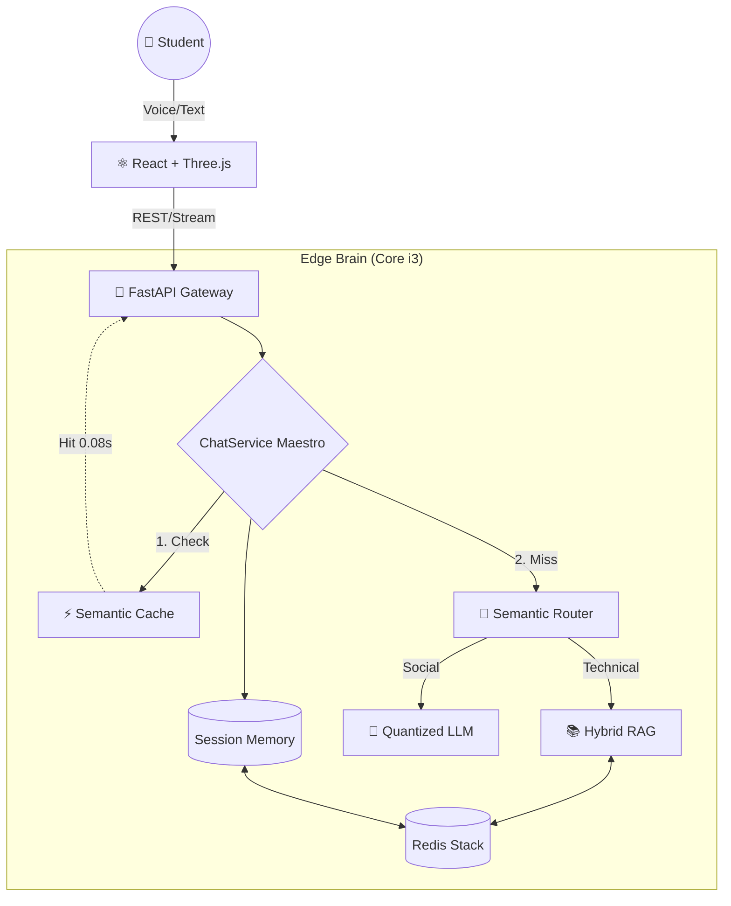

<div align="center">

  

  # BRAZUCATALKS
  
  ### Distributed Frugal AI Ecosystem for Multimodal Tutoring
  
  <!-- ANIMATED TYPING EFFECT -->
  <a href="https://git.io/typing-svg">
    
  </a>

  <!-- PROFESSIONAL BADGES -->
  <p>
    
    
    
  </p>

  <p>
    <a href="#-about-the-project">About</a> •
    <a href="#-sota-architecture">Architecture</a> •
    <a href="#-tech-stack">Tech Stack</a> •
    <a href="#-performance-benchmarks">Performance</a> •
    <a href="#-getting-started">Getting Started</a>
  </p>
</div>


## 💡 About the Project

BrazucaTalks is a high-performance reference implementation of the Frugal AI Ecosystem theoretical framework, recently proposed by the Cambridge Judge Business School (Nov 2025).
While the current AI paradigm remains tethered to multi-billion dollar data centers and unsustainable energy footprints, BrazucaTalks proves that a sophisticated, multimodal, and context-aware AI can thrive on commodity hardware. Developed on a standard Intel Core i3 with 8GB of RAM, this project serves as a bridge between high-level AI research and practical, democratic accessibility in the Global South.
🎯 The Core Challenge
State-of-the-Art (SOTA) Large Language Models (LLMs) often suffer from high latency and prohibitive operational costs. In a distributed systems context, these bottlenecks prevent the scaling of personalized education. BrazucaTalks solves the "AI Trilemma" (Cost, Latency, and Context) through a distributed modular architecture.
🚀 Key Innovations
Semantic Short-Circuiting: By implementing a Semantic Cache Layer using vector similarity search in Redis Stack, the system bypasses heavy neural inference for recurring queries, reducing response latency from ~100s to 0.08s (a 1250x performance boost).
Hybrid Intent Routing: A custom Semantic Router employs a heuristic-neural hybrid approach (Cosine Similarity + Weighted Keyword Boosting) to classify user intents in milliseconds, ensuring that expensive RAG pipelines are only activated when technically necessary.
Distributed Statelessness: The backend is strictly stateless, delegating session management and conversation history to an external Redis instance. This architectural choice enables seamless horizontal scaling and high availability.
Multimodal Edge Intelligence: Integration of quantized SLMs (Small Language Models), int8-quantized STT (Faster-Whisper), and Real-time Lip-Sync via Web Audio API, providing a human-like tutoring experience without any reliance on paid cloud APIs.
🌍 Impact & Relevance
This project demonstrates that Data Sovereignty and Privacy-First AI are achievable for public institutions and schools with limited resources. It stands as a testament to Frugal Engineering: the art of delivering "State-of-the-Art" results through architectural precision rather than brute-force hardware.


## 🏛️ SOTA Architecture

The system employs a **Stateless Distributed Architecture**, orchestrated for maximum resource efficiency.



## Engineering Highlights:
- **Semantic Caching:** Utilizes Vector Search (Cosine Similarity) to identify recurring intents and provide instant  responses, bypassing heavy LLM inference.
- **Hybrid RAG:** Integrated pedagogical knowledge retrieval via PDF/JSON using HNSW indexing in Redis Stack.
- **Linguistic Sovereignty:** Advanced prompt engineering that enforces language policy and prevents persona leaking.

---

## 🛠️ Tech Stack

<div align="center">

| Category | Technologies |
| :--- | :--- |
| **Backend** |    |
| **Frontend** |    |
| **AI & Data** |    |

</div>

---

## 📊 Performance Benchmarks

Real-world metrics captured on a consumer laptop (**Dell Inspiron, i3-1215U, 8GB RAM**):

| Metric | Result | Impact |
| :--- | :--- | :--- |
| **Cache Miss (Generation)** | ~60.0s | Heavy Neural Processing (LLM). |
| **Cache Hit (Semantic)** | **0.08s** | **850x faster.** Zero CPU cost. |
| **Intent Detection** | 0.01s | Mathematical Router (Linear Algebra). |
| **Memory Footprint** | Stable | No OOM Killer (Quantization & ZRAM). |

---

## 🚀 Getting Started

### Prerequisites
*   **Docker & Docker Compose**
*   **Ollama** (with `qwen2.5:1.5b` and `nomic-embed-text` models)
*   **Python 3.11+** (Recommended: [uv](https://github.com/astral-sh/uv))
*   **Node.js 20+**


## Setup Instructions

<details>
<summary><b>1. Infrastructure Setup</b> (Click to expand)</summary>


```Bash
# Start the Vector Database
docker run -d --name redis-stack -p 6379:6379 -p 8001:8001 redis/redis-stack:latest

# Pull AI Models
ollama pull qwen2.5:1.5b
ollama pull nomic-embed-text
```

</details>

<details>
<summary><b>2. Backend Initialization</b> (Click to expand)</summary>

```Bash
# In the project root
uv sync
uv run python -m src.app.rag.ingest_data  # Load knowledge base
PYTHONPATH=src uv run uvicorn app.main:app --reload
```

</details>

<details>
<summary><b>3. Frontend Initialization</b> (Click to expand)</summary>

```Bash
cd frontend
npm install
npm run dev
```
</details>

👨‍💻 Author
<div align="center">
Yuri Matheus
Undergraduate Researcher & Software Architect
IFNMG - Federal Institute of Northern Minas Gerais


</div>
This project was developed as a reference implementation for the Cambridge Frugal AI white paper.


